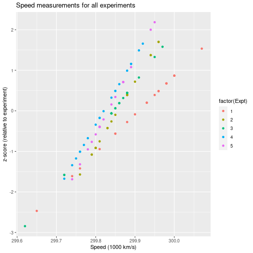
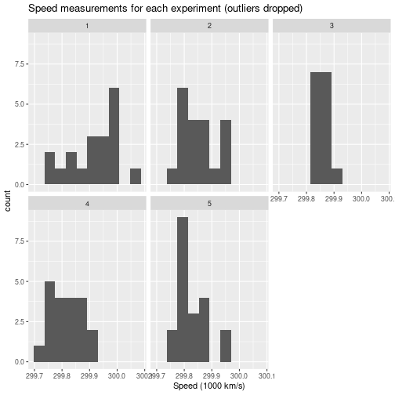
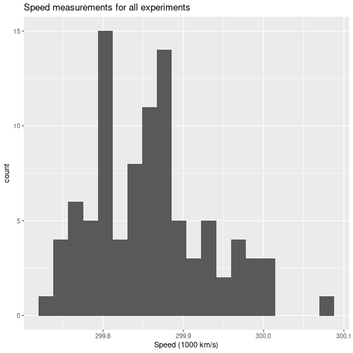

**Complete the following lab as a group.
This document should exist in your GitHub repo while you"re working on it. Your
code should be heavily commented so someone reading your code can follow along
easily. See the first code snippet below for an example of commented code.**

**Here"s the catch: For any given problem, the person writing the code should
not be the person commenting that code, and every person must both code AND
comment at least one problem in this lab (you decide how to split the work).
This will involve lots of pushing and pulling through Git, and you may have to
resolve conflicts if you"re not careful! Refer to last Thursday"s class notes
for details on conflict resolution.**

**ALSO, all plots generated should have labeled axes, titles, and legends when
appropriate. Don"t forget units of measurement! Make sure these plots could be
interpreted by your client.**

These problems were adapted from **Cleaning Data for Effective Data Science**
by David Mertz

# Dealing With Outliers

The Michelson–Morley experiment was an attempt in the late 19th century to
detect the existence of the luminiferous aether, a widely assumed medium that
would carry light waves. This was the most famous “failed experiment” in the
history of physics in that it did not detect what it was looking for—something
we now know not to exist at all.

The general idea was to measure the speed of light under different orientations
of the equipment relative to the direction of movement of the Earth, since
relative movement of the ether medium would add or subtract from the speed of
the wave. Yes, it does not work that way under the theory of relativity, but it
was a reasonable guess 150 years ago.

Apart from the physics questions, the dataset derived by the Michelson–Morley
experiment is widely available, including the sample given in `morley.dat`. The
specific numbers in this data are measurements of the speed of light in km/s
with a zero point of 299,000. So, for example, the mean measurement in
experiment 1 was 299,909 km/s (you can check this when you load the data).

1) Using R to identify the outliers first within each setup (defined by the
`Expt` number) and then within the data collection as a whole. The hope in
the original experiment was that each setup would show a significant
difference in central tendency. We did not cover confidence levels and null
hypotheses, so simply create visualization(s) that aids you in gaining
insight into how much apparent difference exists between the several setups.


```r
library(dplyr)
library(ggplot2)

# Load data
df <- read.csv("morley.dat", sep = "")

# Uncentering speed data
df <- df %>%
    mutate(Speed = Speed + 299000)

# Calculate the Zscore of speed by experiment
df <- df %>%
    group_by(Expt) %>%
    mutate(expt_mean = mean(Speed)) %>%
    mutate(expt_sd = sd(Speed)) %>%
    mutate(zscore = ( Speed - expt_mean) / expt_sd )

# Plot histogram of recorded speed (in thousands km/s) for each experiment
ggplot(
    data = df,
    aes(
        x = Speed / 1000
        )
    ) +
    xlab("Speed (1000 km/s)") +
    ylab("Frequency") +
    geom_histogram(bins = 10) +
    facet_wrap(vars(Expt)) +
    ggtitle("Histogram of Speed measurements for each experiment")
```


```r
# Plot histogram of recorded speed for all experiments
ggplot(
    data = df,
    aes(
        x = Speed / 1000
        )
    ) +
    xlab("Speed (1000 km/s)") +
    ylab("Frequency") +
    geom_histogram(bins = 20) +
    ggtitle("Histogram of Speed measurements in total")
```


```r
# See the spread of data experiment
ggplot(data = df) +
    geom_point(
    aes(
        x = Speed / 1000,
        y = zscore,
        color = factor(Expt)
        )
    ) +
    xlab("Speed (1000 km/s)") +
    ylab("z-score (relative to experiment)") +
    ggtitle("Speed measurements for all experiments")
```



2) If you discard the outliers within each setup, are the differences between
setups increased or decreased? Answer with either a visualization or by looking
at statistics on the reduced groups.


```r
# initialize variables for IQR method
df <- df %>%
    mutate(Q1 = 0) %>%
    mutate(Q3 = 0) %>%
    mutate(IQR = 0)

# Detect outliers using IQR method
for (i in 1:5) {
  df$Q1[df$Expt == i] <- quantile(df$Speed[df$Expt == i], .25)
  df$Q3[df$Expt == i] <- quantile(df$Speed[df$Expt == i], .75)
  df$IQR[df$Expt == i] <- IQR(df$Speed[df$Expt == i])
}

# Only keep rows in dataframe that have values within 1.5*IQR of Q1 and Q3
cleaned <- subset(df, Speed> (Q1 - 1.5*IQR) & Speed< (Q3 + 1.5*IQR))

# Histogram of speed measurement after dropping outliers, by experiment
ggplot(
    data = cleaned,
    aes(
        x = Speed / 1000
        )
    ) +
    xlab("Speed (1000 km/s)") +
    geom_histogram(bins = 10) +
    facet_wrap(vars(Expt)) +
    ggtitle("Speed measurements for each experiment (outliers dropped)")
```



```r
# Histogram of speed measurement after dropping outliers
ggplot(
    data = cleaned,
    aes(
        x = Speed / 1000
        )
    ) +
    xlab("Speed (1000 km/s)") +
    geom_histogram(bins = 20) +
    ggtitle("Speed measurements for all experiments")
```



```r
# scatter plot of measurements vs the z-score relative to the experiment
ggplot(data = cleaned) +
    geom_point(
    aes(
        x = Speed / 1000,
        y = zscore,
        color = factor(Expt)
        )
    ) +
    xlab("Speed (1000 km/s)") +
    ylab("z-score (relative to experiment)") +
    ggtitle("Speed measurements for all experiments")
```


```r
# display statistics of raw and cleaned data (remove redundant info)
df <- df %>%
    select(
        -zscore,
        -expt_mean,
        -expt_sd
        )

cleaned <- cleaned %>%
    select(
        -zscore,
        -expt_mean,
        -expt_sd
        )

summary(df)
```

```
##       Expt        Run            Speed              Q1               Q3        
##  Min.   :1   Min.   : 1.00   Min.   :299620   Min.   :299768   Min.   :299865  
##  1st Qu.:2   1st Qu.: 5.75   1st Qu.:299808   1st Qu.:299800   1st Qu.:299870  
##  Median :3   Median :10.50   Median :299850   Median :299808   Median :299880  
##  Mean   :3   Mean   :10.50   Mean   :299852   Mean   :299813   Mean   :299896  
##  3rd Qu.:4   3rd Qu.:15.25   3rd Qu.:299892   3rd Qu.:299840   3rd Qu.:299885  
##  Max.   :5   Max.   :20.00   Max.   :300070   Max.   :299850   Max.   :299980  
##       IQR       
##  Min.   : 40.0  
##  1st Qu.: 62.5  
##  Median : 85.0  
##  Mean   : 83.0  
##  3rd Qu.: 97.5  
##  Max.   :130.0
```

```r
summary(cleaned)
```

```
##       Expt            Run            Speed              Q1        
##  Min.   :1.000   Min.   : 1.00   Min.   :299720   Min.   :299768  
##  1st Qu.:2.000   1st Qu.: 5.25   1st Qu.:299810   1st Qu.:299800  
##  Median :3.000   Median :11.00   Median :299850   Median :299808  
##  Mean   :3.021   Mean   :10.63   Mean   :299858   Mean   :299811  
##  3rd Qu.:4.000   3rd Qu.:16.00   3rd Qu.:299890   3rd Qu.:299840  
##  Max.   :5.000   Max.   :20.00   Max.   :300070   Max.   :299850  
##        Q3              IQR        
##  Min.   :299865   Min.   : 40.00  
##  1st Qu.:299870   1st Qu.: 62.50  
##  Median :299880   Median : 85.00  
##  Mean   :299896   Mean   : 84.79  
##  3rd Qu.:299885   3rd Qu.: 97.50  
##  Max.   :299980   Max.   :130.00
```

```r
# display some more statistics
df %>%
  group_by(Expt) %>%
  summarise(
    n = n(),
    min = min(Speed),
    max = max(Speed),
    mean = mean(Speed),
    sd = sd(Speed)
  )
```

```
## # A tibble: 5 × 6
##    Expt     n    min    max    mean    sd
##   <int> <int>  <dbl>  <dbl>   <dbl> <dbl>
## 1     1    20 299650 300070 299909  105. 
## 2     2    20 299760 299960 299856   61.2
## 3     3    20 299620 299970 299845   79.1
## 4     4    20 299720 299920 299820.  60.0
## 5     5    20 299740 299950 299832.  54.2
```

```r
cleaned %>%
  group_by(Expt) %>%
  summarise(
    n = n(),
    min = min(Speed),
    max = max(Speed),
    mean = mean(Speed),
    sd = sd(Speed)
  )
```

```
## # A tibble: 5 × 6
##    Expt     n    min    max    mean    sd
##   <int> <int>  <dbl>  <dbl>   <dbl> <dbl>
## 1     1    19 299740 300070 299923.  87.7
## 2     2    20 299760 299960 299856   61.2
## 3     3    15 299840 299910 299861.  21.3
## 4     4    20 299720 299920 299820.  60.0
## 5     5    20 299740 299950 299832.  54.2
```

# Mispelled Names
Our data set `humans-names.csv` contains 25,000 height and weight measurements.
Each row has a person’s first name pulled from the US Social Security Agency
list of common first names over the last century.

Unfortunately, our hypothetical data collectors for this dataset are simply
terrible typists, and they make typos when entering names with alarming
frequency. There are some number of intended names in this dataset, but quite
a few simple miscodings of those names as well. Your goal is to clean up these
mispelled names.

1) Identify every genuine name and correct all the misspelled ones to the
correct canonical spelling. Use all the data wrangling tools you"d like
(e.g. `dplyr` functions), but make sure you"re checking each reassignment to
make sure the names get classified correctly. You"ll fully automate this
process later. It is probably reasonable to assume that rare spellings are
typos, at least if they are also relatively similar to common spellings.
Hint: There are a number of ways to measure the similarity of strings and that
provide a clue as to likely typos. One general class of approach is in terms of
edit distance between strings, which describes how many edititing operations
need to be done to tranform one string into another. The R package `stringdist`
provides Damerau–Levenshtein, Hamming, Levenshtein, and optimal string alignment
as measures of edit distance. Keep in mind that sometimes multiple legitimate
names are actually close to each other in terms of similarity measures (Dan VS
Don, Jacob VS Jakob, etc). If you want to use `stringdist` for this problem,
start by looking at the functions `stringdist()` and `stringdistmatrix()`.


```r
library(stringdist)
library(readxl)
library(dplyr)
library(stringr)

# load data set
humans_names <- read.csv("humans-names.csv")

# names containing non-alphabetic characters are assumed to be an error
humans_names$error <- str_detect(humans_names$Name, "^[[a-z]]")
error1 <- humans_names[humans_names$error == "TRUE", ]

# tally the unique names and create a new data set ordered by frequency
unique_names = humans_names %>%
  select(Name) %>%
  count(Name) %>%
  arrange(n)

# observe that names appearing n<=5 are likely to be errors
unique_names$genuine[unique_names$n > 5] <- 1
unique_names$genuine[unique_names$n <= 5] <- 0

# partition the data set into (likely) genuine and error names
genuine <- unique_names[unique_names$genuine == 1, ]
error <- unique_names[unique_names$genuine == 0, ]

# in error list, calculate stringdist for each error by looping over the list
# of genuine name
for (i in genuine$Name) {
  error$stringdist_i <- stringdist(error$Name, i)
}

# compute the distance matrix between each distinct pair of names in the
# stringdist metric
resultflmatrix <- stringdistmatrix(error$Name, genuine$Name, method = "dl")
resultdf <- data.frame(resultflmatrix)
resultdf$error_name <- error$Name

# search for a closest neighbor in this metric for each name
resultdf[c("min")] <- apply(
    resultdf[c(1:18)], 1, function(x) c(min(x))
    )
resultdf[c("min_index")] <- apply(
    resultdf[c(1:18)], 1, function(x) c(which.min(x))
    )

# overwrite likely error names with their closest neighbor
resultdf$corrected <- genuine$Name[resultdf$min_index]

# the list of corrected names is relatively short; manually check that the
# corrected names are reasonable
resultdf[c("error_name", "corrected")]
```

```
##     error_name corrected
## 1      aBrbara   Barbara
## 2        aDvid     David
## 3        aevid     David
## 4         ames     James
## 5        aMrie     Marie
## 6       arbara   Barbara
## 7          ary      Mary
## 8      atricia  Patricia
## 9      Babrara   Barbara
## 10    Baerbara   Barbara
## 11      Barbar   Barbara
## 12    Barbarea   Barbara
## 13      Daevid     David
## 14       Daivd     David
## 15        Davd     David
## 16      Davied     David
## 17      Deavid     David
## 18       Dvaid     David
## 19        Dvid     David
## 20    eBarbara   Barbara
## 21   Eilzabeth Elizabeth
## 22     eJeames     James
## 23   eJennifer  Jennifer
## 24    eJessica   Jessica
## 25  Elizabeeth Elizabeth
## 26    Elizabeh Elizabeth
## 27   Elizabeht Elizabeth
## 28   Elizabteh Elizabeth
## 29  Elizaebeth Elizabeth
## 30     ennifer  Jennifer
## 31    eRichard   Richard
## 32    eWilliam   William
## 33      ichael   Michael
## 34      illiam   William
## 35     iWlliam   William
## 36      Jaemes     James
## 37        Jame     James
## 38     Jenifer  Jennifer
## 39    Jeninfer  Jennifer
## 40   Jenneifer  Jennifer
## 41     Jennier  Jennifer
## 42    Jennifre  Jennifer
## 43        Jeon       Jon
## 44     Jesscia   Jessica
## 45    Jesseica   Jessica
## 46      Jessia   Jessica
## 47     Jessiac   Jessica
## 48    Jessicea   Jessica
## 49    Jessieac   Jessica
## 50        Jhon       Jon
## 51          Jn       Jon
## 52     Jnnifer  Jennifer
## 53          Jo       Jon
## 54        Joen       Jon
## 55     Joeseph    Joseph
## 56     Joseeph    Joseph
## 57      Josehp    Joseph
## 58       Josep    Joseph
## 59     Josepeh    Joseph
## 60       Jseph    Joseph
## 61     Jsesica   Jessica
## 62      Jsoeph    Joseph
## 63      Jssica   Jessica
## 64   lEizabeth Elizabeth
## 65        Lida     Linda
## 66        Lina     Linda
## 67      Maerie     Marie
## 68       Maery      Mary
## 69       Maire     Marie
## 70         Mar      Mary
## 71       Marei     Marie
## 72      Mareie     Marie
## 73        Mari     Marie
## 74      Mariee     Marie
## 75      Mchael   Michael
## 76    Meichael   Michael
## 77    Micehael   Michael
## 78      Michal   Michael
## 79     Micheal   Michael
## 80    Miechael   Michael
## 81      Mihael   Michael
## 82        Mray      Mary
## 83         noJ       Jon
## 84          on       Jon
## 85      oRbert    Robert
## 86       oseph    Joseph
## 87   Paetricia  Patricia
## 88    Particia  Patricia
## 89   Patericia  Patricia
## 90     Paticia  Patricia
## 91    Patrciia  Patricia
## 92   Peatricia  Patricia
## 93    Reichard   Richard
## 94     Richadr   Richard
## 95      Richar   Richard
## 96    Richared   Richard
## 97     Richrad   Richard
## 98      Rihard   Richard
## 99     Roberet    Robert
## 100     Robetr    Robert
## 101     Roebrt    Robert
## 102      sameJ     James
## 103       Ssan     Susan
## 104      Ssuan     Susan
## 105      Suasn     Susan
## 106       Susa     Susan
## 107     Susean     Susan
## 108       usan     Susan
## 109   Willeiam   William
## 110   Willieam   William
## 111     Wlliam   William
## 112       yarM      Mary
## 113      aindL     Linda
## 114     Babara   Barbara
## 115    Barabra   Barbara
## 116     Barara   Barbara
## 117    Barbaar   Barbara
## 118    Barbraa   Barbara
## 119   Barebara   Barbara
## 120    Brabara   Barbara
## 121     Daveid     David
## 122      daviD     David
## 123     eDavid     David
## 124   eJnnifer  Jennifer
## 125    eJoseph    Joseph
## 126 Eliezabeth Elizabeth
## 127 Elizabeteh Elizabeth
## 128 Elizeabeth Elizabeth
## 129   eMichael   Michael
## 130  ePatricia  Patricia
## 131     eSusan     Susan
## 132    iMchael   Michael
## 133    iRchard   Richard
## 134     Jamees     James
## 135     Jeames     James
## 136  Jeennifer  Jennifer
## 137   Jennfier  Jennifer
## 138    Jennifr  Jennifer
## 139    Jeoseph    Joseph
## 140        Jhn       Jon
## 141      Jmaes     James
## 142       Jmes     James
## 143   Jnenifer  Jennifer
## 144     Joesph    Joseph
## 145       Jonh       Jon
## 146     Leinda     Linda
## 147      Linad     Linda
## 148       Lind     Linda
## 149     Lindea     Linda
## 150       Lnda     Linda
## 151      Marey      Mary
## 152        May      Mary
## 153      Meary      Mary
## 154     Micael   Michael
## 155     Michae   Michael
## 156     Michel   Michael
## 157       nohJ      John
## 158      nusaS     Susan
## 159      obert    Robert
## 160  Patriceia  Patricia
## 161    Patrici  Patricia
## 162  Patriecia  Patricia
## 163     Rboert    Robert
## 164     Rchard   Richard
## 165    Rcihard   Richard
## 166    Reobert    Robert
## 167    Ricahrd   Richard
## 168   Ricehard   Richard
## 169   Richaerd   Richard
## 170    Rihcard   Richard
## 171    Robeert    Robert
## 172      Rober    Robert
## 173      Robet    Robert
## 174     Robret    Robert
## 175     Suesan     Susan
## 176     Susaen     Susan
## 177       Susn     Susan
## 178   Weilliam   William
## 179   Wileliam   William
## 180     Wiliam   William
## 181     Willia   William
## 182    Wliliam   William
## 183       avid     David
## 184   Barbaera   Barbara
## 185       Davi     David
## 186     eJames     James
## 187    eJssica   Jessica
## 188     eLinda     Linda
## 189   Elizabet Elizabeth
## 190      Jaems     James
## 191      Jamse     James
## 192   Jeessica   Jessica
## 193     Jesica   Jessica
## 194      Johen      John
## 195      Joseh    Joseph
## 196     Jospeh    Joseph
## 197      Josph    Joseph
## 198      Lidna     Linda
## 199     Lineda     Linda
## 200       Mayr      Mary
## 201    Mcihael   Michael
## 202   Michaeel   Michael
## 203    Mihcael   Michael
## 204    Paricia  Patricia
## 205   Patricai  Patricia
## 206   Ptaricia  Patricia
## 207    Ptricia  Patricia
## 208   rennifeJ  Jennifer
## 209     Ricard   Richard
## 210   Richeard   Richard
## 211      Robrt    Robert
## 212      Roert    Robert
## 213      Susna     Susan
## 214      uSsan     Susan
## 215   Williaem   William
## 216    Willima   William
## 217       aMry      Mary
## 218      Davdi     David
## 219      eJohn      John
## 220      iLnda     Linda
## 221   Jessieca   Jessica
## 222        Joh       Jon
## 223      Lnida     Linda
## 224       oJhn      John
## 225     oJseph    Joseph
## 226      Rbert    Robert
## 227     Richad   Richard
## 228     Seusan     Susan
## 229  Jenniefer  Jennifer
## 230  Jennifeer  Jennifer
## 231        ohn      John
```


2) For each of the genuine names identified in (1), produce a histogram showing
the distribution of Damerau–Levenshtein distances from the genuine name to the
miscassified data. Make sure distances from genuine names to other genuine names
are not included in these distributions.
Arrange all of the histograms into one figure write a short interpretation of it
intended for a non-statistician client.


3) Write code that reclassifies names similar to problem (1), but fully
automated. You should end up with a function that takes the original data set
and returns a cleaned version. Compare this cleaned data frame to the one
from problem (1) and quantify the accuracy (i.e. what proportion of rows
match?). Make sure your automated process achieves 90%, but shoot for higher
if possible!
